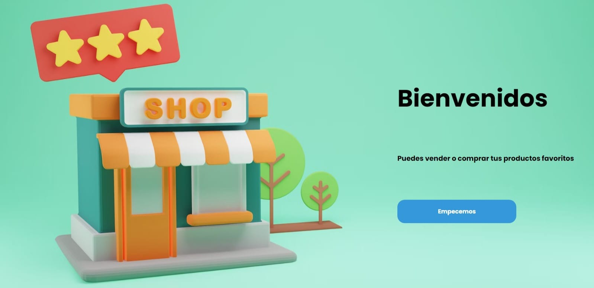
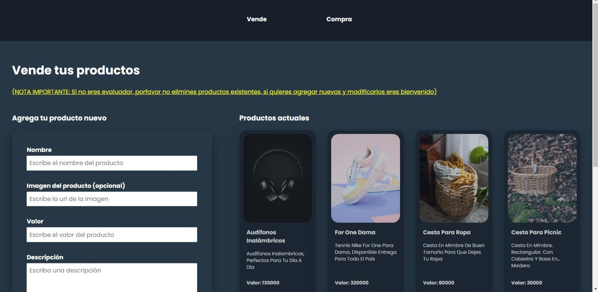
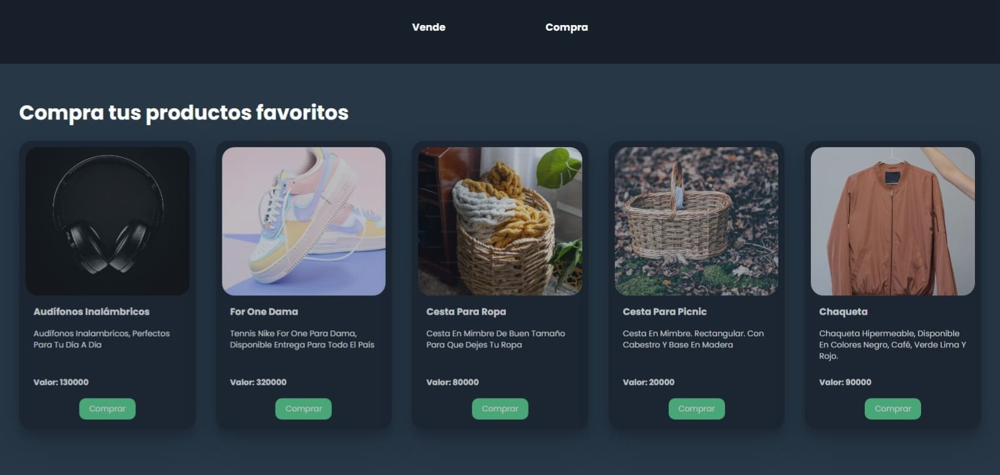

# E-commerce
## Table of contents
* [General info](#general-info)
* [Demo](#demo)
* [App](#app)
* [Technologies](#technologies)
* [Setup](#setup)

---

## General info
This repository contains my e-commerce web application.

I am carrying out this project in the first instance to solve a technical test, and to a greater extent to continue improving my knowledge of frontend development.

The user can navigate between two sections, one where they can buy products and another where they can sell them.

In the sales section they can create, read (view), update and delete products in real time. (CRUD)
In the purchase section at the moment they can read (view) the list of current products in real time.


### Objective
Design and partially implement a simplified e-commerce platform focused on the functionality of the user interface and basic interaction with backend services. The key functionalities to be implemented are product catalog management and order management.

### Criteria
Backend: Quality of the code in TypeScript and compliance with RESTful principles. Integrity and clarity of the API documentation, including CRUD operations.
Frontend: Quality of the implementation in SvelteKit, use of Tailwind CSS and responsiveness of the design.
Documentation and Implementation: Quality of additional documentation, implementation process, and git practices.

### Development
Considering time constraints, I made important decisions with a focus on **user experience (UX) as a priority**.

The application is supported by Firebase, to have the support of a backend, database, and hosting, as these things are transparent to the user.

I created the CRUD functionalities in the front, although connected to Firebase services.

Tailwind was changed to CSS due to problems installing packages in the project, which will be resolved in the future with more time.

The application has a responsive design, although it needs to be polished for the mobile version.

### Possible improvements.

Implement authentication.
Add the shopping cart in the shopping section.
Improve the responsive design with CSS or with a library such as Tailwind, Bootstrap, or MaterialUI.
Routing.
Improve SEO.
Testing with unit tests.

## Demo
Here is a deployed app : https://e-commerce-ac54c.web.app/


## App



	
## Technologies
This project is created with:
* Svelte
* JavaScript
* HTML
* CSS
* Firebase (DB, firestore, hosting)

## Setup
To run this project, after cloning my repository, install it locally using npm:

```
$ cd svelte-e-commerce
$ npm install
$ npm run dev
```
---
Thanks for your visit

## Author
* **Martin Corredor** - [martincorredor](https://github.com/martincorredor)

## [License]

MIT © [Martin Corredor](https://github.com/martincorredor)